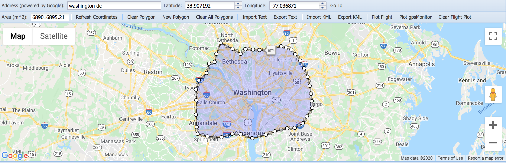
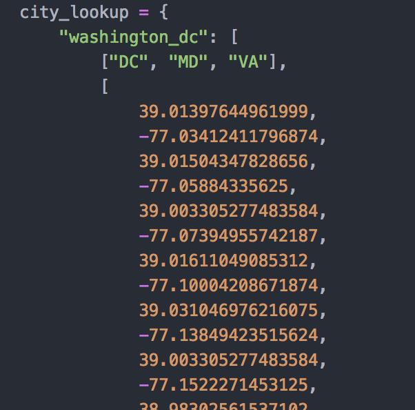
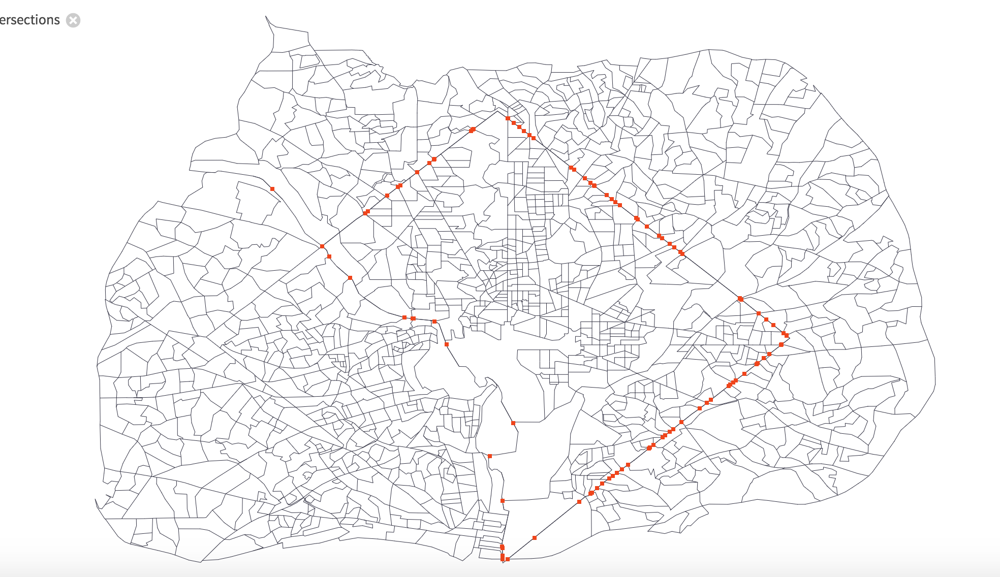

# Census Block Evictions

This repository gives users the ability to scrape eviction data from https://evictionlab.org/ at the most granular level (census block) in order to analyze particular locations of interest in the US.

To collect the right census block data, start by creating a polygon perimeter for the location of interest using a website like http://apps.headwallphotonics.com/ as shown below.

Next, add the location's name as a new key in config.py, and make the value a list where the first value is a list of the polygon's latitudes and longitudes, and the second value is a list of all the states (two-letter state abbreviations) inside the polygon. The entry for Washington DC is shown below.

Once all of the desired locations have been added to config.py, running `python get_census_blocks.py` will generate a CSV and .geojson file for each of the locations and save it to the data directory. The CSV will have the eviction data for all of the locations in the polygon, and the .geojson can be uploaded to a website like https://mapshaper.org/ to visually confirm the right census blocks were selected as shown below for Washington DC.

